<a href="https://s31f.dev">
  <picture>
    <source media="(prefers-color-scheme: dark)" srcset="banner-dark.svg">
    
  </picture>
</a>

Prices and work: **[s31f.dev](https://s31f.dev)** · Have a task? **[Write on Telegram](https://t.me/s31fdev)**
